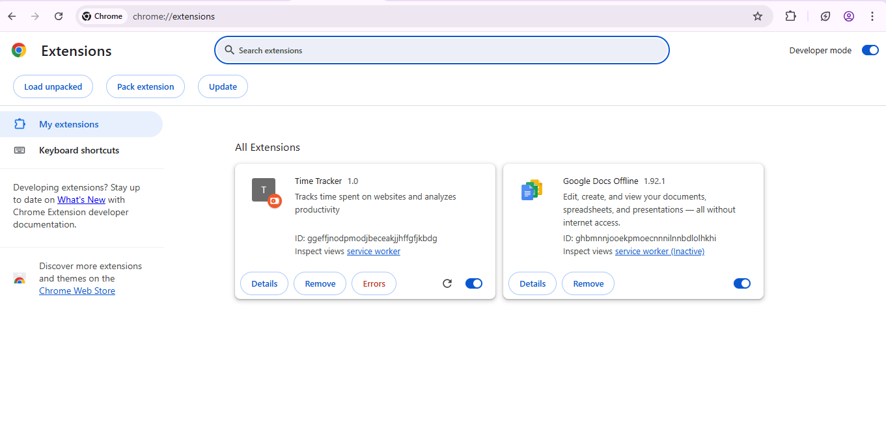
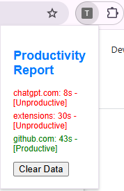
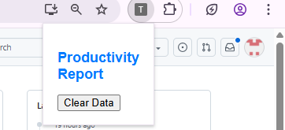

# ⏱ Chrome Time Tracker Extension

A Chrome Extension that tracks the time spent on different websites and classifies them as productive or unproductive.

## 📌 Features
- Tracks active time on each tab
- Stores data locally using Chrome Storage API
- Classifies sites like GitHub, Stack Overflow as productive
- Popup UI with a clear data button

## 🛠 Built With
- HTML, CSS, JavaScript
- Chrome Extension APIs
- VS Code

<<<<<<< HEAD
## 📷 Screenshots
*Add screenshots here showing the popup and tracking UI.*
=======
## 🚀 Live Output

Here are a few screenshots showing the extension in action:

### ✅ Extension Installed

### 📊 Popup Showing Time Tracking

### 🧹 After Clicking "Clear Data"

>>>>>>> 4e01b9d (Merge remoe changes)

## 🚀 How to Use
1. Clone this repo
2. Go to `chrome://extensions`
3. Enable **Developer Mode**
4. Click **Load Unpacked**
5. Select this folder

## 🧠 Learning Outcome
Learned how to build browser extensions, use background scripts, and work with tab activity tracking.

---

⭐️ If you like this project, give it a star!

